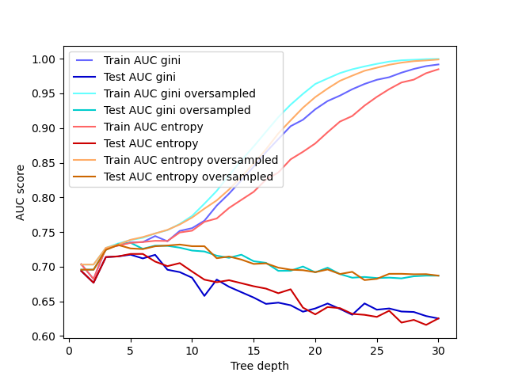

# classification_decisionTrees_shippingData_Python
Considerations for selecting decision trees for binary classification problems.

The [shippingData_decisionTree.ipynb](https://github.com/THouwe/classification_decisionTrees_shippingData_Python/blob/main/shippingData_decisionTree.ipynb) notebook shows how to perform model selection for decision trees in binary classification problems.
It is divided in the following sections:

- A. Decision Tree (DT): Summary
- B. Data inspection & preparation
- C. Model selection
- D. Model predictions & interpretation

It uses as an example an e-commerce dataset composed of 10999 purcheses (rows), 11 features, and a binary target (on time / not on time).
Target represents whether a product has been delivered on time (1) or not (0).
Features include information regarding customers, product, and shipment.
The dataset can be downloaded from Kaggle: https://www.kaggle.com/datasets/prachi13/customer-analytics

The notebook focuses on deciding on whether to (i) over-/under-sample the data in case of imbalanced datasets, (ii) use gini or entropy as criteria, and (iii) limiting tree depth.

It also shows how to interpret the tree and things to pay attention to

